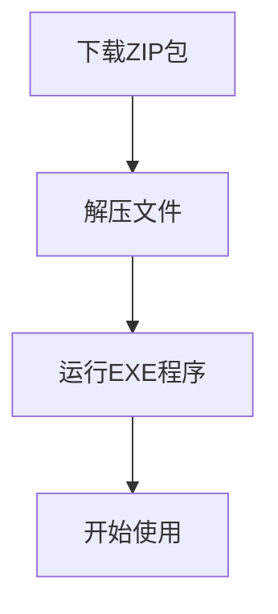
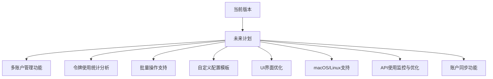

# <div align="center">✨ Cursor Manager ✨</div>

<div align="center">
  
</div>

<div align="center">
  <h3>Cursor AI编辑器增强工具 - 解锁全部功能，提升您的编程体验</h3>
</div>

<div align="center">
  
  
  
  
</div>

<div align="center">
  <a href="#-主要功能">主要功能</a> •
  <a href="#-下载安装">下载安装</a> •
  <a href="#-使用说明">使用说明</a> •
  <a href="#-技术栈">技术栈</a> •
  <a href="#-路线图">路线图</a> •
  <a href="#-常见问题">常见问题</a> •
  <a href="#-免责声明">免责声明</a>
</div>

<br>

<div align="center">
  
</div>

<br>

<hr>

## 🚀 项目介绍

<table>
<tr>
<td>

Cursor Manager 是一款专为 [Cursor](https://cursor.sh/) AI编辑器设计的增强管理工具。它可以帮助您解锁 Cursor 的全部功能，管理浏览器会话，重置机器ID，并提供更流畅的使用体验。无论您是免费用户还是付费用户，Cursor Manager 都能帮助您充分利用 Cursor 编辑器的强大功能。

</td>
</tr>
</table>

<hr>

## ✅ 主要功能

<table>
<tr>
<th>功能</th>
<th>描述</th>
</tr>
<tr>
<td>🔄 <b>重置机器ID</b></td>
<td>解决设备限制问题</td>
</tr>
<tr>
<td>🧹 <b>完全重置Cursor</b></td>
<td>清除所有配置和缓存</td>
</tr>
<tr>
<td>🌐 <b>语言切换</b></td>
<td>支持中英文界面</td>
</tr>
<tr>
<td>📋 <b>配置查看</b></td>
<td>显示当前Cursor配置信息</td>
</tr>
<tr>
<td>🔑 <b>账户授权检查</b></td>
<td>验证当前账户状态</td>
</tr>
<tr>
<td>🚫 <b>令牌限制绕过</b></td>
<td>优化令牌使用策略</td>
</tr>
<tr>
<td>🌎 <b>浏览器管理</b></td>
<td>自动管理浏览器会话</td>
</tr>
<tr>
<td>🕵️ <b>无痕浏览模式</b></td>
<td>保护隐私的浏览方式</td>
</tr>
<tr>
<td>📧 <b>邮箱验证码获取</b></td>
<td>简化账号验证流程</td>
</tr>
<tr>
<td>⚙️ <b>Cursor进程管理</b></td>
<td>一键关闭应用或进程</td>
</tr>
<tr>
<td>🔄 <b>自动更新</b></td>
<td>一键更新到最新版本</td>
</tr>
</table>

<hr>

## 📥 下载安装

### 系统要求

<table>
<tr><td>操作系统</td><td>Windows 10/11</td></tr>
<tr><td>前置条件</td><td>已安装 Cursor 编辑器</td></tr>
<tr><td>权限</td><td>管理员权限（部分功能需要）</td></tr>
</table>

### 安装方法

<div align="center">
  


</div>

1. 从 [GitHub Releases](https://github.com/Xie-Rutai/cursor-manager/releases/latest) 下载最新版本
2. 解压缩下载的文件到任意位置
3. 运行 `Cursor-Manager.exe` 启动程序

> 💡 **提示**: 如果下载速度较慢，建议使用代理加速GitHub访问

<hr>

## 📖 使用说明

### 基本操作

<div align="center">
  <table>
  <tr>
    <td><b>步骤 1</b></td>
    <td>启动 Cursor Manager</td>
  </tr>
  <tr>
    <td><b>步骤 2</b></td>
    <td>从主菜单选择所需功能</td>
  </tr>
  <tr>
    <td><b>步骤 3</b></td>
    <td>按照屏幕提示完成操作</td>
  </tr>
  </table>
</div>

### 功能详解

<details>
<summary><b>🔄 1. 重置机器ID</b></summary>
<p>重置 Cursor 的机器标识，适用于解决多设备使用限制问题。</p>

```
操作步骤:
1. 从主菜单选择 "1. 重置机器ID"
2. 确认操作
3. 等待重置完成
```
</details>

<details>
<summary><b>🧹 2. 完全重置Cursor</b></summary>
<p>清除所有 Cursor 配置和缓存，恢复到全新安装状态。</p>

```
操作步骤:
1. 从主菜单选择 "2. 完全重置Cursor"
2. 确认操作 (注意: 此操作将删除所有设置)
3. 等待重置完成
```
</details>

<details>
<summary><b>🌐 3. 语言切换</b></summary>
<p>切换 Cursor Manager 的界面语言。</p>

```
操作步骤:
1. 从主菜单选择 "3. 切换语言"
2. 选择所需语言
```
</details>

<details>
<summary><b>📋 4. 显示配置信息</b></summary>
<p>查看当前 Cursor 的配置详情。</p>

```
操作步骤:
1. 从主菜单选择 "4. 显示配置信息"
2. 查看配置详情
```
</details>

<details>
<summary><b>🔑 5. 检查账户授权</b></summary>
<p>验证当前 Cursor 账户的授权状态。</p>

```
操作步骤:
1. 从主菜单选择 "5. 检查账户授权"
2. 查看授权状态
```
</details>

<details>
<summary><b>🚫 6. 绕过令牌限制</b></summary>
<p>优化 Cursor 的令牌使用策略，提升AI功能使用体验。</p>

```
操作步骤:
1. 从主菜单选择 "6. 绕过令牌限制"
2. 按照提示完成设置
```
</details>

<details>
<summary><b>🌎 7. 浏览器管理器</b></summary>
<p>管理专用浏览器会话，简化 Cursor 登录和使用流程。</p>

```
操作步骤:
1. 从主菜单选择 "7. 浏览器管理器"
2. 选择所需的浏览器操作
```
</details>

<details>
<summary><b>🕵️ 8. 无痕浏览模式</b></summary>
<p>启动隐私保护的浏览模式。</p>

```
操作步骤:
1. 从主菜单选择 "8. 无痕浏览模式"
2. 等待浏览器启动
```
</details>

<details>
<summary><b>📧 9. 邮箱验证码获取</b></summary>
<p>简化 Cursor 账号注册和登录的验证流程。</p>

```
操作步骤:
1. 从主菜单选择 "9. 邮箱验证码获取"
2. 按照提示操作
```
</details>

<details>
<summary><b>⚙️ 10-11. Cursor应用管理</b></summary>
<p>快速关闭 Cursor 应用或终止相关进程。</p>

```
操作步骤:
- 选择 "10. 关闭Cursor应用" 优雅关闭应用
- 选择 "11. 关闭Cursor进程" 强制终止进程
```
</details>

<details>
<summary><b>🔄 12. 检查软件更新</b></summary>
<p>自动检查并更新 Cursor Manager 到最新版本。</p>

```
操作步骤:
1. 从主菜单选择 "12. 检查软件更新"
2. 如有更新，按照提示完成安装
```
</details>

<hr>

## 🛠 技术栈

<div align="center">
  
  
  
</div>

### 核心技术

<table>
<tr>
<td align="center"><br><b>Python</b></td>
<td>主要开发语言</td>
</tr>
<tr>
<td align="center"><br><b>PyInstaller</b></td>
<td>打包为独立可执行文件</td>
</tr>
<tr>
<td align="center"><br><b>Windows Registry API</b></td>
<td>用于修改系统注册表</td>
</tr>
<tr>
<td align="center"><br><b>GitHub API</b></td>
<td>用于自动更新功能</td>
</tr>
</table>

<hr>

## 🗺 路线图

<div align="center">



</div>

- 🔲 多账户管理功能
- 🔲 令牌使用统计分析
- 🔲 批量操作支持
- 🔲 自定义配置模板
- 🔲 UI界面优化
- 🔲 macOS/Linux支持
- 🔲 API使用监控与优化
- 🔲 账户同步功能

<hr>

## ❓ 常见问题

<details>
<summary><b>软件安全吗？</b></summary>
<p>Cursor Manager 是开源软件，您可以检查源代码确保安全性。本工具仅对 Cursor 编辑器的配置文件和环境进行管理，不会收集任何个人信息。</p>
</details>

<details>
<summary><b>更新失败怎么办？</b></summary>
<p>如果自动更新失败，请尝试：</p>
<ol>
<li>检查网络连接（GitHub 在某些地区可能需要代理）</li>
<li>手动下载最新版本替换旧文件</li>
<li>确保您有足够的权限修改程序文件</li>
</ol>
</details>

<details>
<summary><b>为什么有些功能需要管理员权限？</b></summary>
<p>某些功能（如重置机器ID）需要修改系统受保护的文件或注册表，因此需要管理员权限才能正常工作。</p>
</details>

<details>
<summary><b>如何正确卸载？</b></summary>
<p>Cursor Manager 不会在系统中安装额外文件，直接删除程序文件夹即可完成卸载。</p>
</details>

<hr>

## 📊 项目统计

<div align="center">

### 实时项目数据

<div style="background-color: white; padding: 20px; margin: 10px; border-radius: 5px;">
  <a href="https://star-history.com/#Xie-Rutai/cursor-manager&Date" target="_blank">
    
  </a>
</div>

<br>

<p><b>项目活跃度</b></p>

<a href="https://github.com/Xie-Rutai/cursor-manager">
  
</a>
<a href="https://github.com/Xie-Rutai/cursor-manager/network/members">
  
</a>
<a href="https://github.com/Xie-Rutai/cursor-manager/watchers">
  
</a>

<br><br>

<p>访问量统计</p>


</div>

<hr>

<div align="center">
  <p>
  Copyright © 2025 Cursor Manager
  </p>
</div>

<hr>

## ⚠️ 免责声明

<table>
<tr>
<td>

本工具仅供学习和研究使用，请遵守 Cursor 的服务条款和相关法律法规。使用本工具产生的任何后果由用户自行承担。作者不对任何可能的账户封禁、数据丢失或其他损失负责。

</td>
</tr>
</table> 
